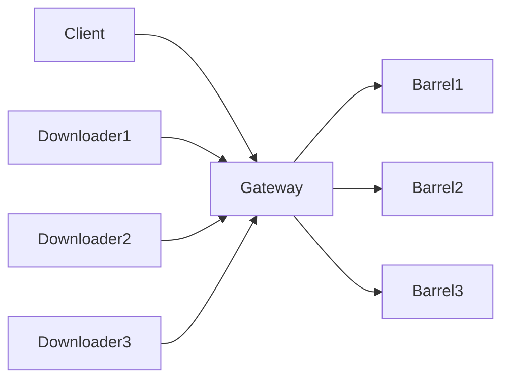
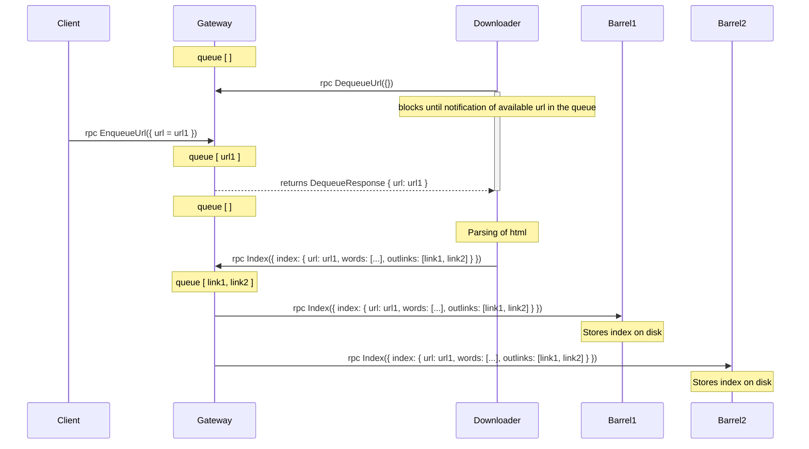
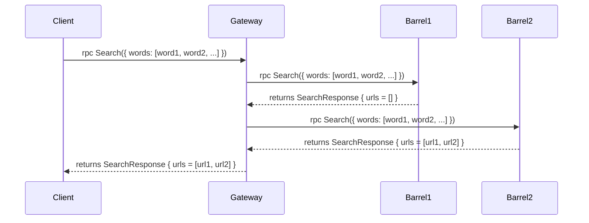
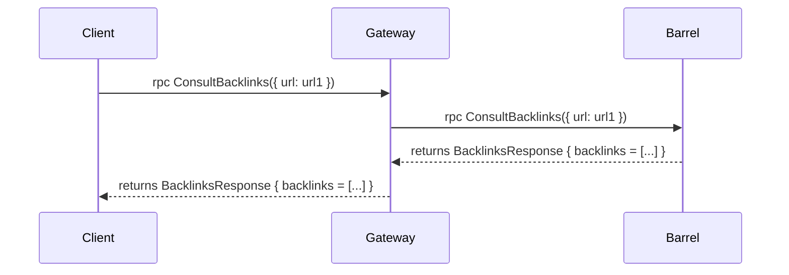
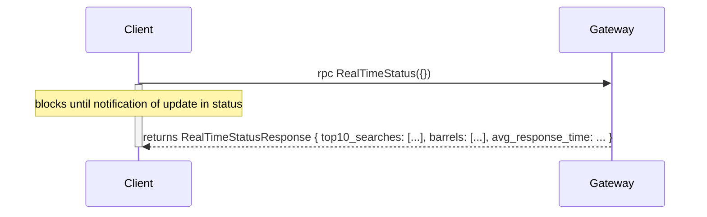
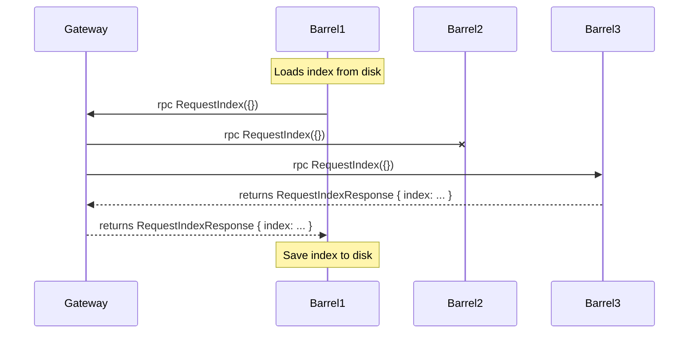
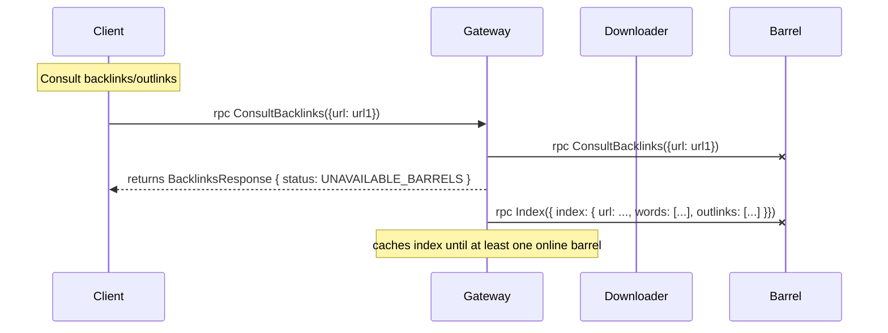

# googol

Search engine and web crawler written in Rust.

Visit [page](https://shelltux.github.io/googol.rs).

# Architecture

Components of the system:

- Gateway
- Barrel Orchestrator
- Barrel
- Downloader
- Web Server



## Services

```proto
!include ./protos/googol.proto
```

## Dataflow

### Index a new url

```shell
cargo run --bin=client -- enqueue --url 'url1'
```



### Search pages that contain keywords

```shell
cargo run --bin=client -- search_words --words 'words'
```



### Consult Backlinks/Outlinks for given page



### Real Time stats

```shell
cargo run --bin=client -- real-time-status
```




### Barrel on boot



## Failover

### Failing Barrel



### Failing Gateway

If the gateway is offline the downloaders keep trying with exponential backoff.

### Failing Downloader

### Failing Client

## Webserver

Endpoints:

- /
  - GET
- /health
  - GET
- /enqueue
  - POST
  - json { url: String }
- /search
  - GET
  - Query Params Url encoded. example: `curl address/search?words=vitae`
- /ws
  - GET
  - header must include WebSocket Upgrade

## Testing

| Requisito Funcional                                                  | Pontuação | 60                      | Testes adicionais |
| -------------------------                                            | :-:       | :--:                    | :--:              |
| Indexar novo URL introduzido por utilizador                          | 10        | \textcolor{green}{Pass} |                   |
| Indexar iterativamente ou recursivamente todos os URLs encontrados   | 10        | \textcolor{green}{Pass} |                   |
| Pesquisar páginas que contenham um conjunto de palavras              | 10        | \textcolor{green}{Pass} |                   |
| Páginas ordenadas por número de ligações recebidas de outras páginas | 10        | \textcolor{green}{Pass} |                   |
| Consultar lista de páginas com ligações para uma página específica   | 10        | \textcolor{green}{Pass} |                   |
| Resultados de pesquisa paginados de 10 em 10                         | 10        | \textcolor{red}{Fail}   |                   |

| WebSockets                                                                       | Pontuação | 14                                      | Testes adicionais |
| -------------------------                                                        | :-:       | :--:                                    | :--:              |
| Top 10 de pesquisas mais comuns atualizado em tempo real                         | 7         | \textcolor{green}{Pass}                 |                   |
| Lista de barrels ativos com os respetivos tamanhos do índice e tempo de resposta | 7         | \textcolor{yellow}{Missing barrel size} |                   |
| Grupos de 3: Lista de barrels indica as partições do índice (-7)                 | 0         | \textcolor{red}{Fail}                   |                   |

| APIs REST                                                                        | Pontuação | 16                    | Testes adicionais |
| -------------------------                                                        | :-:       | :--:                  | :--:              |
| Indexar URLs de fonte externa (p.ex., HackerNews) contendo os termos da pesquisa | 8         | \textcolor{red}{Fail} |                   |
| Gerar um texto contextualizado com IA (API REST de OpenAI, Gemini, Ollama, etc.) | 8         | \textcolor{red}{Fail} |                   |

| Relatório                                                        | Pontuação | 10                      | Testes adicionais |
| -------------------------                                        | :-:       | :--:                    | :--:              |
| Arquitetura do projeto Web detalhadamente descrita               | 2         | \textcolor{red}{Fail}   |                   |
| Integração de API com o servidor RPC/RMI                         | 2         | \textcolor{green}{Pass} |                   |
| Integração de WebSockets com API e RPC/RMI                       | 2         | \textcolor{green}{Pass} |                   |
| Integração de REST WebServices no projeto                        | 2         | \textcolor{red}{Fail}   |                   |
| Testes de software (tabela: descrição e pass/fail de cada teste) | 2         | \textcolor{red}{Fail}   |                   |

| Extra (até 5 pontos)                       | Pontuação | 0                       | Testes adicionais |
| -------------------------                  | :-:       | :--:                    | :--:              |
| Utilização de HTTPS (5 pts)                |           | \textcolor{green}{Pass} |                   |
| Utilização em smartphone ou tablet (2 pts) |           | \textcolor{red}{Fail}   |                   |
| Outros                                     |           | \textcolor{red}{Fail}   |                   |

| Pontos Obrigatórios                              | Pontuação | 0                       | Testes adicionais |
| -------------------------                        | :-:       | :--:                    | :--:              |
| O projeto corre distribuído por várias máquinas  | -5        | \textcolor{green}{Pass} |                   |
| Código HTML e Rust estão separados               | -5        | \textcolor{green}{Pass} |                   |
| A aplicação não apresenta erros/exceções/avarias | -5        | \textcolor{green}{Pass} |                   |
| Código legível e bem comentado                   | -5        | \textcolor{green}{Pass} |                   |
